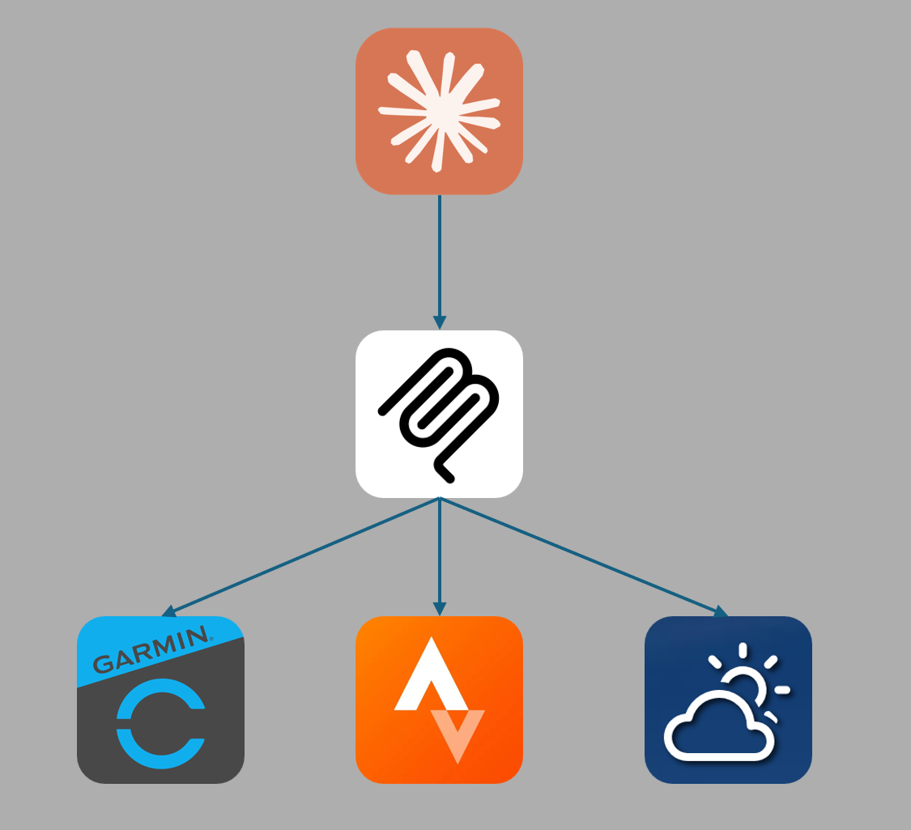

# MSSE-Capstone-Project — MCP Starter for Garmin + Weather

This repository is a starter Model Context Protocol (MCP) server for an MSSE capstone project. It provides a focused integration point for Garmin activity data and external weather information so users can better plan their workouts.



## Purpose

This project is intended as a minimal, well-documented starting point for building an MCP-compatible service that:

- Collects activity and health data from Garmin (via Python Wrapper API).
- Enriches activity data with weather and forecast information from a weather API.
- Provides an interface (MCP endpoints / context provider) so agents or tools can query user activity + environmental context to make workout recommendations.

The README below describes the design contract, required configuration, and a quick-start development flow

## Quick contract (inputs / outputs)

TBD

## Environment / configuration

This project relies on three small pieces of developer tooling:

- uv  
  A lightweight task/venv helper used here to create and run the dev environment. Typical commands used in this repo:

  - Create venv: `uv venv`
  - Add deps: `uv add "mcp[cli]"`
  - Run the server: `uv run server.py`
    uv simply launches the project and its Python interpreter (you'll see a parent `uv` process and a child `python` process).

- Python virtual environments  
  Use an isolated venv for all installs and runs. Recommended commands (macOS / zsh):

  ```bash
  python3.13 -m venv .venv
  source .venv/bin/activate
  ```

  Install packages inside the venv (editable/local install preferred): `pip install -e .` or `pip install "mcp[cli]"`.

- Model Context Protocol (MCP) Python SDK  
  This repo uses the MCP SDK for server primitives and tooling. Install via pip (inside the venv):
  ```bash
  pip install "mcp[cli]"
  ```
  SDK docs and examples: https://github.com/modelcontextprotocol/python-sdk — consult the SDK for server patterns, endpoint shapes, and testing helpers.

Notes

- Keep the venv active for development commands and when running the server.
- Claude Desktop can auto-launch the server using the `uv` command in its config; restart Claude after code changes to ensure it re-registers endpoints.
- TODO: add any required env vars or API credentials once external clients (Garmin / weather) are implemented.

## Authentication flows

TBD

## Project structure

TBD

## Getting started (developer flow)

This project uses uv for dependency management

1. Create & activate a virtual environment (macOS / zsh)

```bash
uv venv
source .venv/bin/activate
```

2. Install dependencies

```bash
uv add "mcp[cli]"
```

3. Run the server (optional, see note below)

```bash
uv run server.py
# stop: Ctrl+C
```

4. Quick checks & diagnostics

```bash
# list server processes
pgrep -af server.py
```

It's expected that two PIDs are running, one for uv (the parent) and one for the server.py.

Below is a sample mcp config.json for Claude. When using claude, claude will automatically start up the server, so there is no need to manually start the server each time. For troubleshooting, its also important to restart Claude after every change for this reason.

```
{
  "mcpServers": {
    "MSSE-Capstone-Project": {
      "command": "/Users/[username]/.local/bin/uv",
      "args": [
        "--directory",
        "/Users/[username]/MSSE-Capstone-Project",
        "run",
        "/Users/[username]/MSSE-Capstone-Project/server.py"
      ]
    }
  }
}
```

## Example API endpoints (suggested)

TBD

## Contributing

Contributions are welcome. Please open issues for bugs and feature ideas, and submit PRs against `main` with tests and a short changelog entry.

## License

This project is released under the terms of the MIT License. See `LICENSE` for details.
