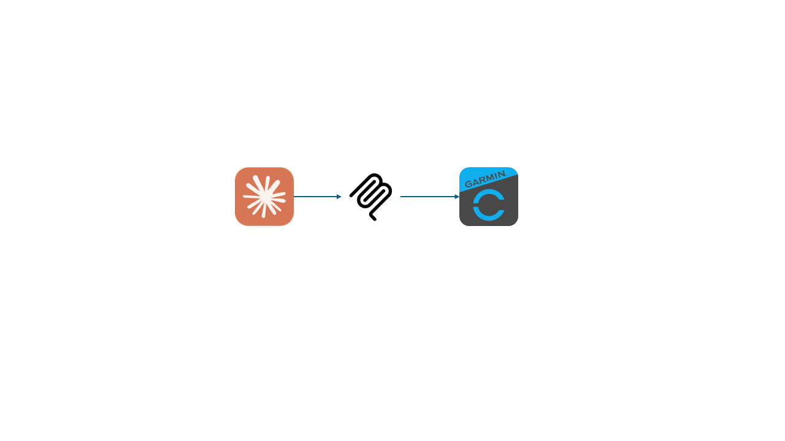

# MSSE-Capstone-Project — MCP Server for Garmin Data

This repository provides a Model Context Protocol (MCP) server for an MSSE capstone project. It integrates with Garmin Connect to provide activity and health data through MCP tools, enabling AI agents to access workout information, user preferences, and equipment availability.



## Purpose

This MCP server provides:

- **Garmin data integration**: Activity stats, body battery, sleep, HRV, stress, training readiness, and activity history
- **User preferences management**: Workout preferences and available equipment stored locally
- **MCP-compatible interface**: Tools that AI agents can use to query and store user data
- **Authentication handling**: Robust MFA support for Garmin Connect authentication

## Available MCP Tools

### Garmin Data Tools

- **`daily_stats(mfa_code: str = None)`** - Today's activity statistics (steps, distance, calories, floors)
- **`last_activity(mfa_code: str = None)`** - Most recent workout/activity details
- **`body_battery(start_date: str, end_date: str = None, mfa_code: str = None)`** - Body battery data for date range
- **`all_day_stress(start_date: str, end_date: str = None, mfa_code: str = None)`** - Stress level data
- **`sleep_data(start_date: str, end_date: str = None, mfa_code: str = None)`** - Sleep analysis data
- **`hrv_data(start_date: str, end_date: str = None, mfa_code: str = None)`** - Heart rate variability metrics
- **`training_readiness(mfa_code: str = None)`** - Current training readiness score
- **`training_status(mfa_code: str = None)`** - Training status and load information
- **`activities(start_date: str, end_date: str = None, activity_type: str = None, sort_order: str = None, mfa_code: str = None)`** - Activity history with filtering

### User Preferences Tools

- **`workout_preferences(preferences_data: dict = None)`** - Get or set workout preferences (goals, frequency, intensity, restrictions)
- **`available_equipment(equipment_data: dict = None)`** - Get or set available workout equipment

### Utility Tools

- **`steps_to_miles(steps: int)`** - Convert steps to miles (steps ÷ 2000)

### Authentication Flow

All Garmin tools support MFA authentication:

1. **First call**: Uses saved tokens from `~/.garminconnect` if available, otherwise logs in with credentials from `garmin_config.json`
2. **If MFA required**: Tool returns `mfa_required` error with instructions
3. **Provide MFA code**: Call tool again with `mfa_code="123456"` parameter
4. **Subsequent calls**: Uses saved tokens automatically

## Requirements

- **Python 3.13+**
- **uv** (recommended) or pip for dependency management
- **Garmin Connect account** with credentials

## Configuration

### Garmin Setup

1. Copy the template: `cp garmin_config.json.template garmin_config.json`
2. Edit `garmin_config.json` with your Garmin credentials:
   ```json
   {
     "email": "your.email@example.com",
     "password": "your_password",
     "token_dir": "~/.garminconnect"
   }
   ```
3. Tokens are automatically saved to `~/.garminconnect` after first successful authentication

### Claude Desktop Integration

Add to your Claude Desktop config file (`~/Library/Application Support/Claude/claude_desktop_config.json`):

```json
{
  "mcpServers": {
    "MSSE-Capstone-Project": {
      "command": "/Users/[username]/.local/bin/uv",
      "args": [
        "--directory",
        "/Users/[username]/MSSE-Capstone-Project",
        "run",
        "server.py"
      ]
    }
  }
}
```

**Note:** Restart Claude Desktop after any code changes to reload the server.

## Getting Started

### Installation

1. **Clone the repository**

   ```bash
   git clone https://github.com/kafargo/MSSE-Capstone-Project.git
   cd MSSE-Capstone-Project
   ```

2. **Set up virtual environment**

   Using uv (recommended):

   ```bash
   uv venv
   source .venv/bin/activate
   ```

   Or using standard Python:

   ```bash
   python3.13 -m venv .venv
   source .venv/bin/activate
   ```

3. **Install dependencies**

   Using uv:

   ```bash
   uv sync
   ```

   Or using pip:

   ```bash
   pip install -e .
   # For development dependencies:
   pip install -e ".[dev]"
   ```

4. **Configure Garmin credentials**
   ```bash
   cp garmin_config.json.template garmin_config.json
   # Edit garmin_config.json with your credentials
   ```

### Running the Server

**For development/testing:**

```bash
uv run server.py
```

**With Claude Desktop:** The server starts automatically when Claude launches (no manual start needed)

### Verify Installation

```bash
# Run tests
make test

# Check server processes (when running manually)
pgrep -af server.py
```

## Testing

This project uses pytest with comprehensive test coverage.

### Quick Commands

```bash
# Run all tests
make test

# Run only unit tests
make test-unit

# Run with coverage report
make test-coverage

# Run MCP-specific tests
make test-mcp

# Run Garmin client tests
make test-garmin
```

### Test Structure

```
tests/
├── conftest.py                  # Shared fixtures and configuration
├── test_garmin_client.py        # Unit tests for Garmin client
├── test_preferences_client.py   # Unit tests for preferences client
├── test_mcp_tools.py            # Integration tests for MCP tools
└── test_utils.py                # Test utilities and helpers
```

### Test Categories (Markers)

- `@pytest.mark.unit` - Fast tests with mocked dependencies
- `@pytest.mark.integration` - Tests with real component interaction
- `@pytest.mark.mcp` - MCP server and tool functionality
- `@pytest.mark.garmin` - Garmin client functionality
- `@pytest.mark.slow` - Tests that make real API calls (use sparingly)

### Running Specific Tests

```bash
# Run a specific test file
pytest tests/test_garmin_client.py

# Run a specific test class or function
pytest tests/test_garmin_client.py::TestConfigManagement::test_load_config_existing_file

# Run tests matching a pattern
pytest tests/ -k "mfa"

# Run tests with specific markers
pytest tests/ -m unit
```

## Project Structure

```
MSSE-Capstone-Project/
├── server.py                    # MCP server with tool definitions
├── msse_capstone/
│   ├── __init__.py
│   └── clients/
│       ├── garmin_client.py     # Garmin Connect integration
│       └── preferences_client.py # User preferences management
├── tests/                       # Test suite
├── garmin_config.json.template  # Template for Garmin credentials
├── workout_preferences.json     # Stored workout preferences
├── available_equipment.json     # Stored equipment data
├── pyproject.toml              # Project dependencies and metadata
├── pytest.ini                  # Test configuration
└── Makefile                    # Common development tasks
```

## Contributing

Contributions are welcome. Please open issues for bugs and feature ideas, and submit PRs against `main` with tests and a short changelog entry.

## License

This project is released under the terms of the MIT License. See `LICENSE` for details.
